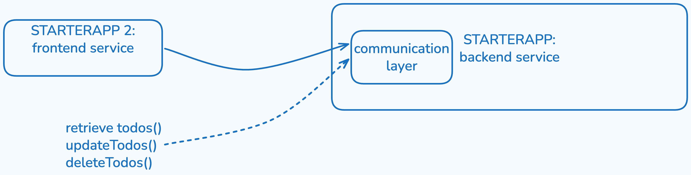

# hse-26-summer

Distributed Systems lecture collected material, summaries and questions.
Also this repository will hold example code.

## Distributed Systems - 19.03.26

General introduction into

- what a distributed system is
- advantages and disadvantages
- how it relates to cloud computing
- Service Models: IaaS, PaaS, SaaS

## Cloud Native Development - 27.03.26

Introduction into the developers perspective of the cloud world

- Pillars of Cloud Native Development
- Microservices
- Staging
- Scaling
- CAP theorem
- Conways law
- 12 Factor Apps

## Cloud Native Development in Practice - 10.04.26

Introduction into the practical side of cloud native development:

- Frameworks
  - General Idea
  - Benefits
  - Spring Boot
  - Spring ecosystem
- Interservice Communication
  - Synchronous vs Asynchronous Communication
  - REST
  - Resources, Verbs and Representations
  - Richardson Maturity Model

### Questions for Exam Preparation

- With the basic Rest Controller having a local Arraylist as storage of TodoItems: what are potential issues in the long run, where does this conflict with concepts we learned about?

